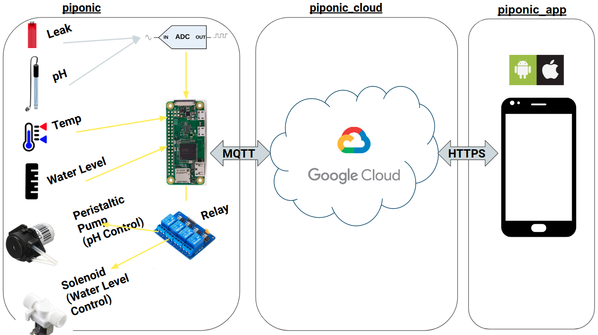

#  piponic_app 

## Project Description

This project aims to reduce urban food insecurity by reducing the cost and labour requirements of monitoring aquaponic or hydroponic food-growing systems. Designed specifically for hobbyist or small-scale growers, our project monitors critical system variables such as pH, temperature, and water-level and provides autonomous control. Critical notifications, real-time information, control settings, and system-history is available to users on a mobile application. 

 &nbsp;&nbsp;&nbsp;  &nbsp;&nbsp;&nbsp; 

Our work contributes a low-cost, open-source hardware design, and IoT development framework that will allow hobbyists to expand and modify the system for their own needs. By simplifying the communication protocols, growers can focus on adding new sensors instead of worrying about data-security. 

Our system can also operate on battery power in the event of a power-outage, a critical failure in aquaponic systems. This feature allows growers to be notified and to begin to take corrective action within the minute of the outage.

## This Repository 

The mobile application for users to remotely monitor and control their aqua/hydroponic installation. Implemented using Google's Flutter.

## Related Repositories



- [piponic](https://github.com/jaydenleong/piponic): A sensing and control system for aquaponics or hydroponics. Runs on a Raspberry Pi and connects to the mobile application using this repository.
- [piponic_cloud](https://github.com/jaydenleong/piponic_cloud): Google Firebase functions that connect Raspberry Pis and the mobile application.
- [piponic_docs](https://github.com/jaydenleong/piponic_docs): Detailed documentation for this project.

## App Setup

Since this application uses Google Flutter and Google Firebase, some setup is required. To setup Google Flutter, follow these steps: 

- [Flutter Installation](https://flutter.dev/docs/get-started/install)

Once you have Flutter installed, you will need to create a project, then associate this app with Firebase.

- [Setting up a Firebase Project](https://firebase.google.com/docs/projects/learn-more)
- [Associating the Flutter app with Firebase](https://firebase.google.com/docs/flutter/setup?platform=ios)

**NOTE:** if you already have a Firebase project, use the second link above to setup your app with the proper keys, especially `google-services.json`. Otherwise, the app will not connect to Firebase.

## Running the app

Please follow Flutter tutorials like this [Write your first Flutter app](https://flutter.dev/docs/get-started/codelab) tutorial to learn how to debug, test, and run the app.

## Code Documentation

The Flutter codebase shared between IOS and Android is in the `lib/` directory. It is organized as follows: 

- `main.dart`: entry point to the application
- `page/`: pages displayed by the mobile application
- `config/`: app configuration files
- `utils/`: utilities
- `widgets/`: custom widgets

## Android Release ## 

Currently, we have not released the application to the Google Play Store. 
Instead, we are generating a release version of the app (an APK file) that
can be shared with trusted users via Google Drive and installed on Android. 
To create an APK file, run: 

```
flutter build apk --release
```

Optionally, to install on an Android phone connected your computer via USB cable, run: 

```
flutter install
```

To download on other devices, upload the `build/app/outputs/flutter-apk/app-release.apk` file to Google Drive. Then, on the 
target android device go to `Settings -> Apps & Notifications -> Advanced -> Special app access -> Install Unknown Apps`. Then allow Google Drive to install APK files. 

Then, on your Android device, open the Google Drive app and navigate
to the APK file. Then, click on it to download the file and install it.

**NOTE:** see [Flutter Documentation](https://flutter.dev/docs/deployment/android) for more information about creating a release version of an application for Android.

## Future Development

- Improve responsiveness of `chart_page.dart`
- Add IoS version of the app